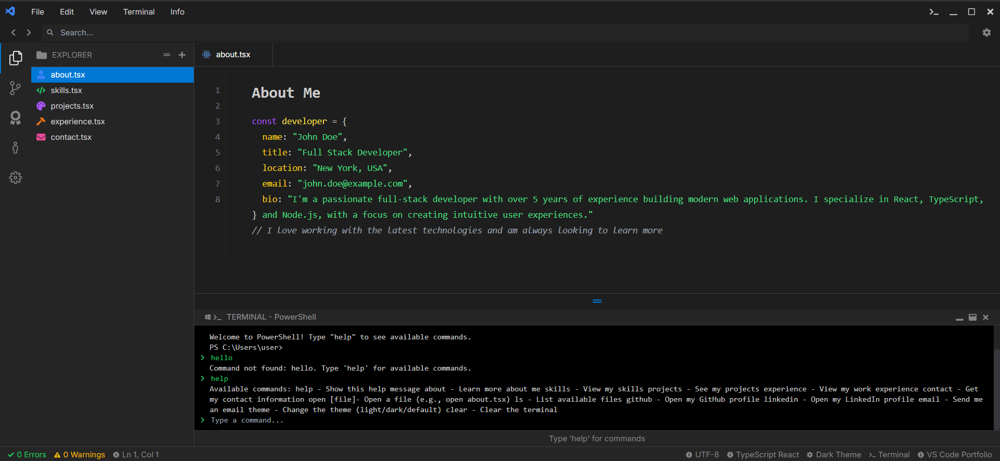

# VS Code Portfolio 🚀

A modern portfolio website that mimics the VS Code interface, built with Next.js, TypeScript, and Tailwind CSS. Perfect for developers who want to showcase their work in a familiar IDE-like environment.



## ⚠️ Important Note

**First-time compilation may take up to 3 seconds** due to the dynamic content loading and VS Code theme implementation. Subsequent loads will be much faster.

## ✨ Features

- 🎨 VS Code-like interface with multiple theme support
- 📱 Fully responsive design
- ⚡ Fast page loads with Next.js
- 🎯 TypeScript for type safety
- 🎨 Tailwind CSS for styling
- 📦 Easy content management through config file
- 💻 Interactive file explorer with resizable sidebar
- 📝 Syntax highlighting
- 🔍 SEO optimized
- ⚙️ Customizable font size and themes
- 🔗 Clickable skill links

## 📸 Screenshots

### Dark Theme


### Light Theme


### Skills with Links


### Customizable Settings


## 🛠️ Technologies Used

- [Next.js](https://nextjs.org/) - React framework
- [React](https://reactjs.org/) - UI library
- [TypeScript](https://www.typescriptlang.org/) - Type safety
- [TailwindCSS](https://tailwindcss.com/) - Styling
- [React Icons](https://react-icons.github.io/react-icons/) - Icons

## 🚀 Getting Started

### Prerequisites

- Node.js (v14 or later)
- npm or yarn

### Installation

1. Clone the repository:
```bash
git clone https://github.com/Genius740Code/vscode-portfolio.git
cd vscode-portfolio
```

2. Install dependencies:
```bash
npm install
# or
yarn install
```

3. Edit your portfolio content in `src/config/portfolio.ts`

4. Run the development server:
```bash
npm run dev
# or
yarn dev
```

5. Open [http://localhost:3000](http://localhost:3000) in your browser

## 🎨 Customization

### Portfolio Content

Edit `src/config/portfolio.ts` to update your:
- Personal information
- Skills (with optional links)
- Projects
- Work experience
- Social links

### Styling and Settings

- **Themes**: Choose from multiple themes in the settings panel
- **Font Size**: Adjust text size for better readability
- **Sidebar Width**: Resize the sidebar by dragging the edge

## 📦 Deployment

This project can be easily deployed to Vercel, Netlify, or any other hosting platform that supports Next.js.

```bash
npm run build
# or
yarn build
```

## 🤝 Contributing

Contributions, issues, and feature requests are welcome! Feel free to check the [issues page](https://github.com/yourusername/vscode-portfolio/issues).

## 📝 License

This project is licensed under the MIT License - see the [LICENSE](LICENSE) file for details.

## 👨‍💻 Author

Your Name
- GitHub: [@YourGitHub](https://github.com/yourusername)
- LinkedIn: [Your LinkedIn](https://linkedin.com/in/your-profile)